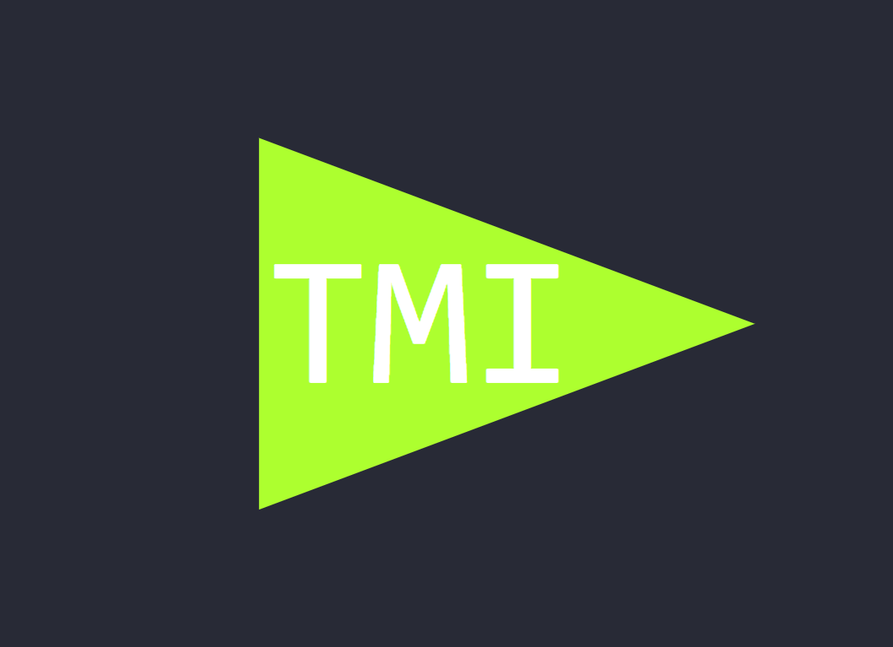
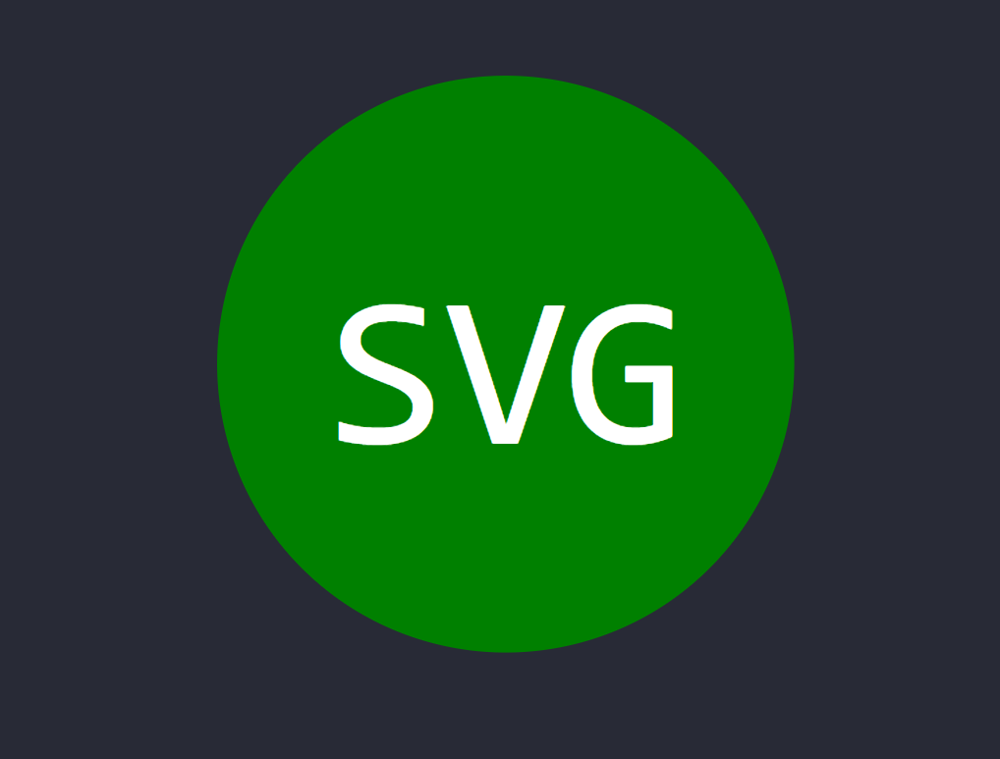
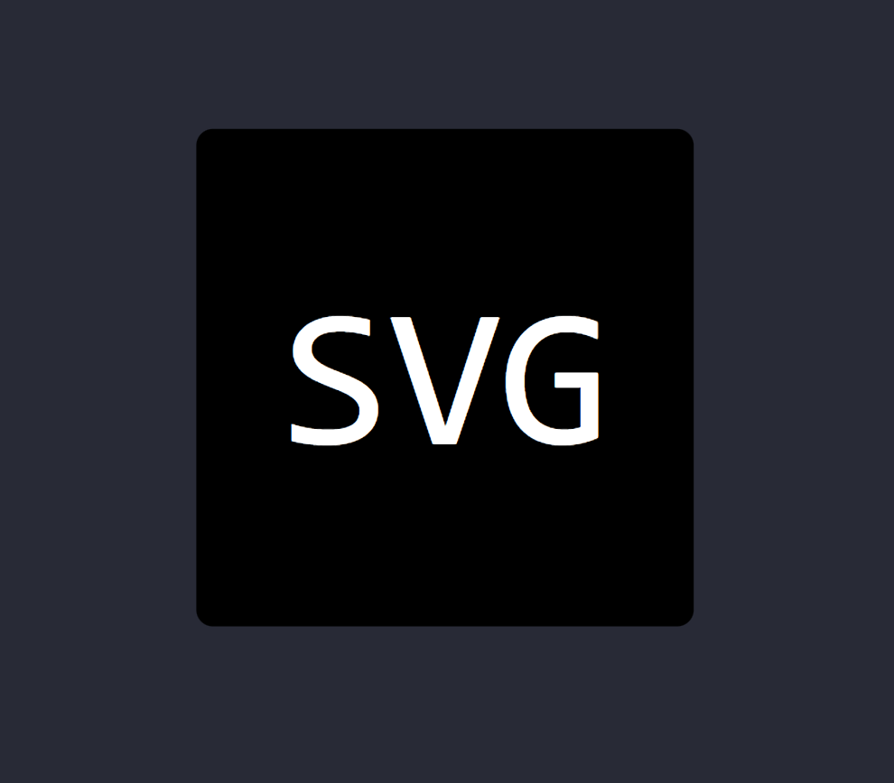

# SVG Generator

## Description
This app allows the user to generate an svg logo by answering four questions in the VScode terminal.

## Table of Contents
- [Usage](#usage)
- [Credits](#credits)
- [License](#license)
- [How to Contribute](#how-to-contribute)
- [Tests](#tests)
- [Questions](#questions)

## Visuals

## Usage 
The user will enter "node index.js" into their VScode terminal and answer the questions they are prompted with. The first question will ask for a three letter acrynym and second for a color of the text entered. The third question will give you a choice of three shapes, triangle, circle, or square. The final question will ask for a color of the shape selected. Once they answer the final quesion a logo.svg file will be created in the examples folder. Note that the colors entered need to be either a color keyword like "red" or a hexidecimal number starting with # like "#4F5B66".
(Note: The user will need node installed as well as inquirer and jest from npm in order to use this app.)

## Credits
JD Tadlock for all the instruction in the Rutgers Coding Bootcamp

## License
#### MIT
A short and simple permissive license with conditions only requiring preservation of copyright and license notices. Licensed works, modifications, and larger works may be distributed under different terms and without source code.
[Link to License](https://opensource.org/license/MIT)
You can also check out the LICENSE in the repo.

## How to Contribute
Check out the [Contributor Covenant](https://www.contributor-covenant.org/version/2/1/code_of_conduct/code_of_conduct.md)

## Tests
There is a test.shapes.js file that can be run in the VScode terminal by entering "npm test". The test will see if the correct shape string with a color of blue is present in the chosen shape class.

## Questions
If you have any questions check out my [Github](https://github.com/TIrwin19) or send me an email at .
